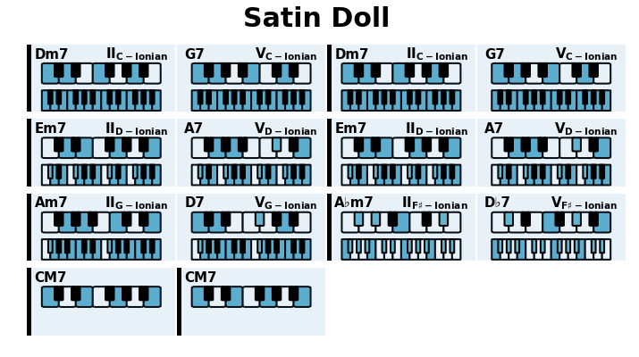
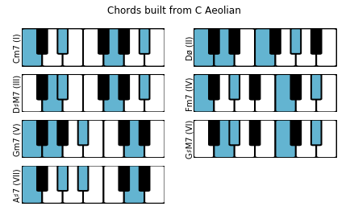
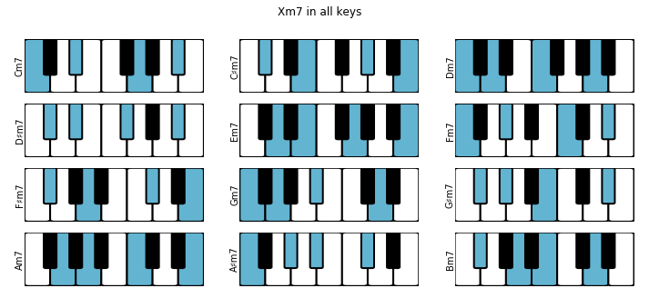
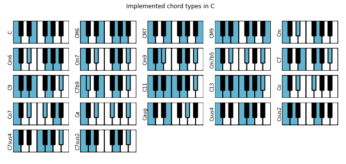

The primary goal of this package is to help in the analysis of a chord progression and facilitate learning of jazz standards.  
For example, we can enter a progression as a string, ask to analyse then plot the results each cell shows the chord, its degree in the corresponding scale, and optionally the coresponding notes.  

[Examples and Basic Documentation](https://github.com/NeuralControl/jazzTheory/blob/master/demos.ipynb)  

From a chord progression, we can analyze and plot the results:  
prg = Progression('|Dm7,G7|Dm7,G7|Em7,A7|Em7,A7|Am7,D7|Abm7,Db7|CM7|CM7|',name='Satin Doll')  
prg.analyze()  
prg.plot()  

  

Print all Chords in a given Scale:  
  

Plot all m7 for all roots:  
  

Plot implemented chords:  

