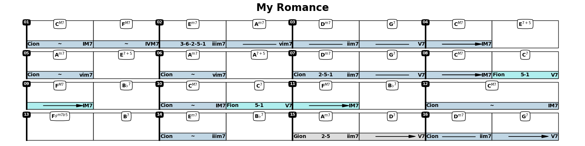
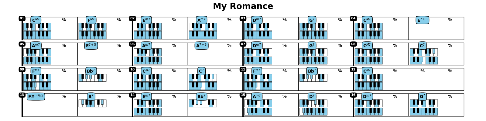

The primary goal of this package is to help in the analysis of a chord progression and facilitate learning of jazz standards.  
It will also suggest alternative chords, progressions, scales etc     
For example, we can enter a progression as a string, ask to analyse then plot the results.   
Each cell shows the chord, its degree in the corresponding scale, and optionally the corresponding notes.  
**Right now we have a skeleton with the basics, working on the analysis.**

[Basic Examples](https://github.com/NeuralControl/jazzTheory/blob/master/demos.ipynb)  

From a chord progression, we can analyze and plot the results:
```python
prg = Progression('|CM7,FM7|Em7,Am7|Dm7,G7|CM7,E7#5|Am7,E7#5|Am7,A7#5|Dm7,G7|CM7,C7|'
                      'FM7,Bb7|CM7,C7|FM7,Bb7|CM7|F#m7b5,B7|Em7,Bb7|Am7,D7|Dm7,G7|',name='My Romance')  
prg.analyze()  
prg.plot('fn')  
```
 
 
 
From a chord progression, we can analyze and plot the results:
```python
prg.plot('kbd')  
```
  


Plot all Chords in a given Scale:  
```python
Scale('C minor').plotChords()
```
  

Plot all m7 for all roots:  

  

Plot implemented chords:  


