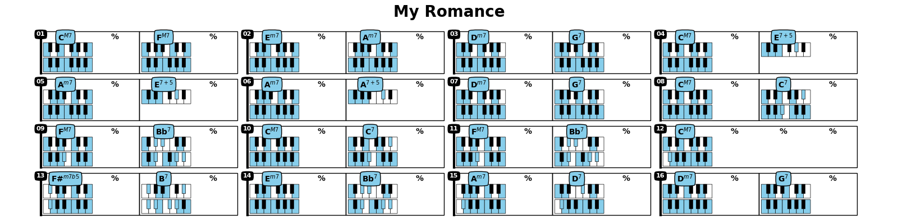
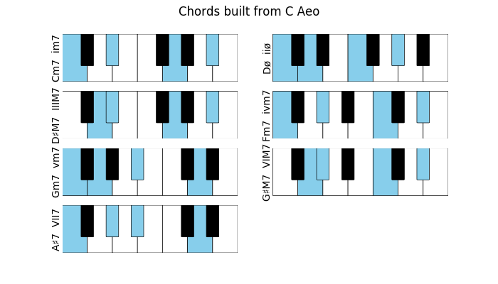

jazzElements
============

.. image:: https://readthedocs.org/projects/jazzelements/badge/?version=latest
    :target: https://jazzelements.readthedocs.io/en/latest/?badge=latest
    :alt: Documentation Status

The primary goal of this package is to help in the analysis of a chord progression and facilitate learning of jazz standards.
It will also suggest alternative chords, progressions, scales etc     
For example, we can enter a progression as a string, ask to analyse then plot the results.   
Each cell shows the chord, its degree in the corresponding scale, and optionally the corresponding notes.  

The full documentation can be found on `ReadTheDocs <https://jazzelements.readthedocs.io/en/latest/?badge=latest>`_

.. Hint:: The best resource i found to learn about jazz and music theory, check it out:

        - "WalkThatBass_" youtube channel.
        - "TheJazzPianoSite_" website.

.. _WalkThatBass: https://www.youtube.com/c/walkthatbass
.. _TheJazzPianoSite: http://www.thejazzpianosite.com/jazz-piano-lessons

.. WARNING:: I am coding this in parallel to trying to finally understand music theory.
    This is in active dev with surely a good amount of hacks and bugs. Feel free to contribute/submit issues or ideas.

We can annotate a chord progression:

>>> prg = Progression('|CM7,FM7|Em7,Am7|Dm7,G7|CM7,E7#5|Am7,E7#5|Am7,A7#5|Dm7,G7|CM7,C7|FM7,Bb7|CM7,C7|FM7,Bb7|CM7|F#m7b5,B7|Em7,Bb7|Am7,D7|Dm7,G7|',name='My Romance')
>>> prg.annotate()
>>> prg.plot('fn')

We can plot the harmonic analysis
 .. image:: img/MyRomanceFn.png
    :width: 500pt

or the chords (top) and scales (bottom):

>>> prg.plot('kbd')

The analysis can be made for example using the major/minor chord progression from the book Tonal Harmony by Stefan Kostka

.. list-table::

    * - .. figure:: img/seqMajKostka.png

           Major Kostka Progression

      - .. figure:: img/seqMinKostka.png

           Minor Kostka Progression

Plot all Chords in a given Scale:

>>> Scale('C minor').plotChords()

Plot m7 for all roots:

.. image:: img/allKeys.png
    :width: 500pt

Plot implemented chords:

.. image:: img/implementedChords.png
    :width: 500pt

