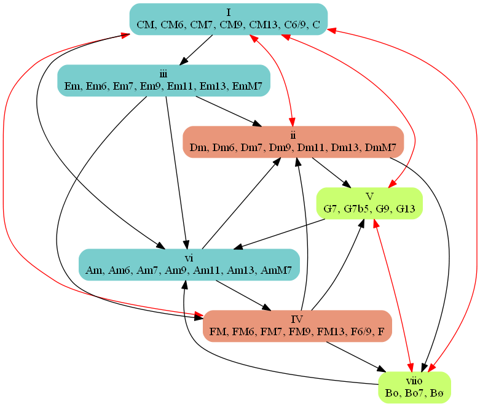
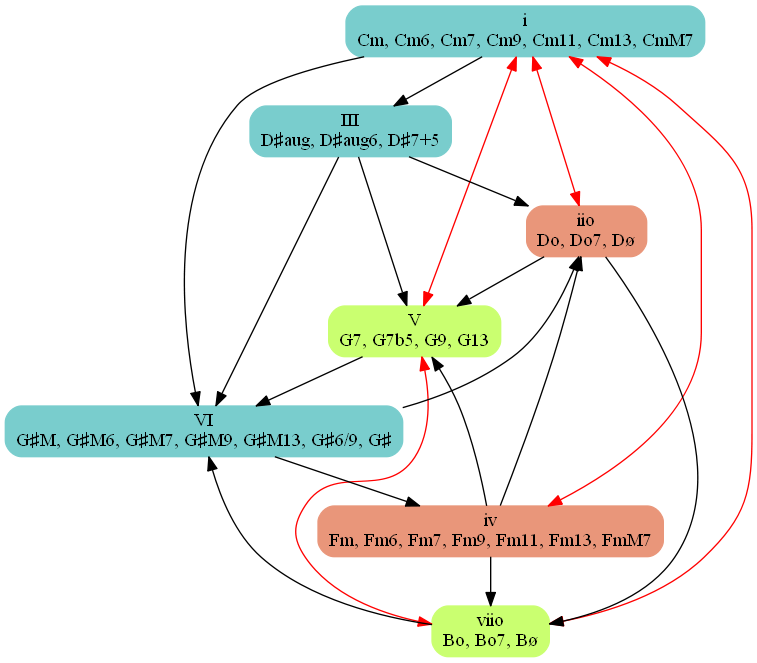
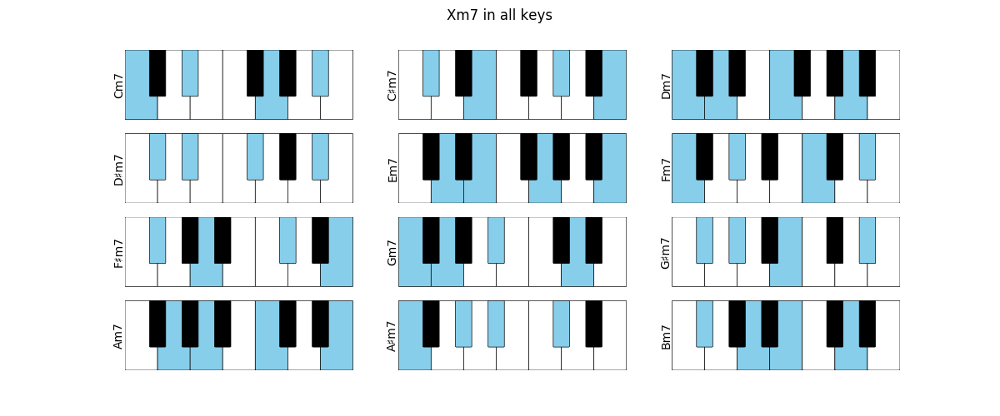
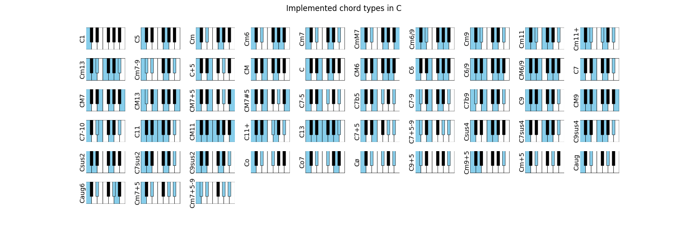

.. image:: https://readthedocs.org/projects/jazzelements/badge/?version=latest
    :target: https://jazzelements.readthedocs.io/en/latest/?badge=latest
    :alt: Documentation Status

More information on `ReadTheDocs <https://jazzelements.readthedocs.io/en/latest/?badge=latest>`_

The primary goal of this package is to help in the analysis of a chord progression and facilitate learning of jazz standards.
It will also suggest alternative chords, progressions, scales etc     
For example, we can enter a progression as a string, ask to analyse then plot the results.   
Each cell shows the chord, its degree in the corresponding scale, and optionally the corresponding notes.  
**Right now we have a skeleton with the basics, working on the analysis.**

We can annotate a chord progression:

>>> prg = Progression('|CM7,FM7|Em7,Am7|Dm7,G7|CM7,E7#5|Am7,E7#5|Am7,A7#5|Dm7,G7|CM7,C7|FM7,Bb7|CM7,C7|FM7,Bb7|CM7|F#m7b5,B7|Em7,Bb7|Am7,D7|Dm7,G7|',name='My Romance')
>>> prg.annotate()
>>> prg.plot('fn')

We can plot the harmonic analysis
 .. image:: img/MyRomanceFn.png
    :width: 500pt

or the chords (top) and scales (bottom):

>>> prg.plot('kbd')

.. image:: img/MyRomanceKbd.png
    :width: 500pt

The analysis is now made using the major/minor chord progression from Tonal Harmony by Stefan Kostka

Plot all Chords in a given Scale:

>>> Scale('C minor').plotChords()

Plot m7 for all roots:

Plot implemented chords:

Contents
========
.. toctree::
   :hidden:
   :maxdepth: 5

   note